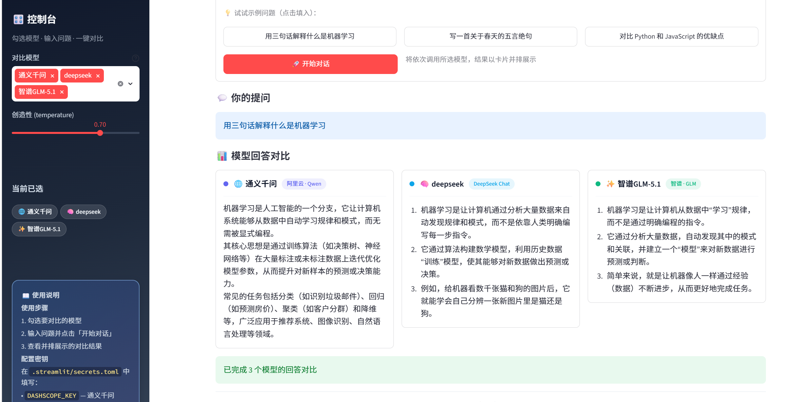

readme

# 🤖 AI模型对比助手
> 一个基于python代码的轻量Web应用，对比通义千问、deepseek和智普三个大模型的回答差异。

## ✨ 功能特点 
> 可以选择调用任意数量的大模型(最多3个)
> 美观的界面
> 并排对答案，效果差异一目了然

## 🖼️ 效果预览

### 环境要求
- Python 3.9+
- pip install streamlit openai

## 操作步骤
- 安装必要环境
- 下载并解压文件
- 获取通义千问、deepseek和智普的API密钥
- 将ai-chat-compare\.streamlit文件夹以记事本方式打开，并加上你的密钥
- 运行.bat文件

## 📝 AI 声明

本项目在开发过程中借助了AI辅助工具（如deepseek、Cursor）进行：

- 代码测试与图形界面优化
- Bug分析与修改
- 说明文档美化
  
**核心逻辑**、**功能设计**和**说明撰写**由开发者独立完成
